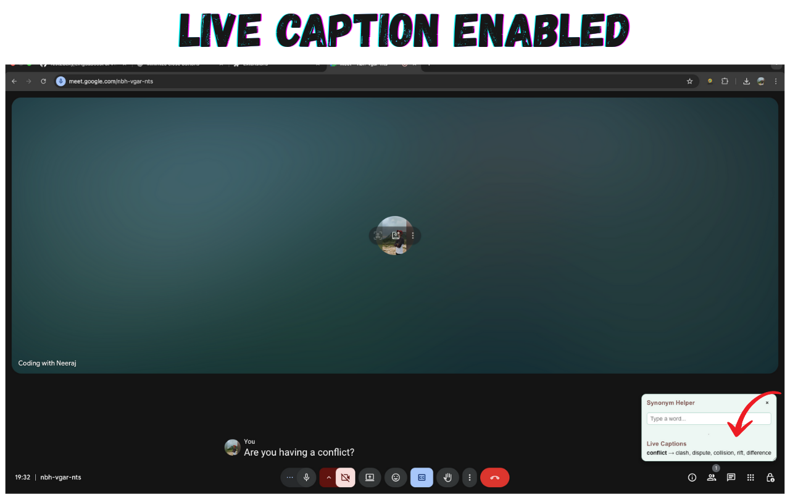
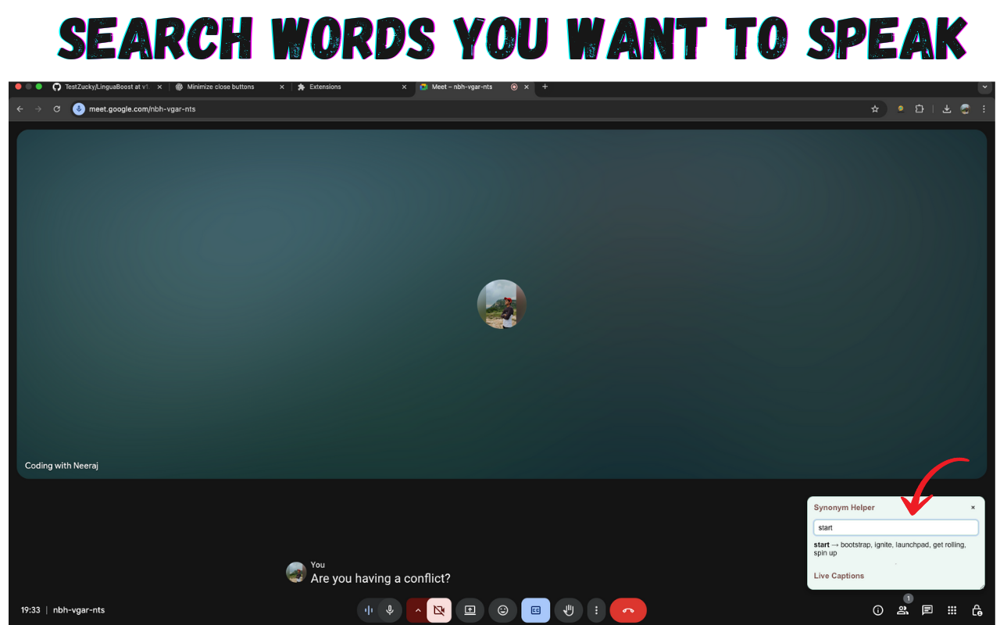
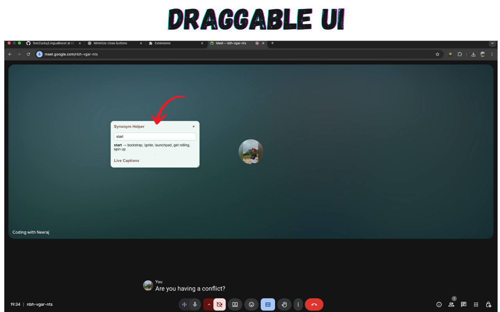

# LinguaBoost

LinguaBoost is a Chrome extension that helps you sound more polished in technical meetings.  
It listens to captions (currently works with Google Meet captions enabled) and suggests better synonyms or jargon words you can use in your replies.

For example:

- Instead of saying **"start the project"**, you can say **"kick off the project"**.
- Instead of **"problem"**, you can say **"challenge"** or **"roadblock"**.

### ✨ Features

- Real-time caption detection (Google Meet)
- Suggests alternative words/synonyms to make your replies sound sharper
- Technical + corporate jargon dictionary (~1000 terms in progress)
- Works in replies context (not for initial prompts)

### 🚀 Roadmap

- Support for microphone capture (no captions needed)
- Expand the jargon/synonym dictionary
- Support for more meeting platforms (Zoom, MS Teams, etc.)

### 🛠️ Development

1. Clone the repo
2. Load the extension in Chrome (Developer Mode → Load unpacked)
3. Join a Google Meet with captions enabled
4. Get real-time suggestions while you talk

---

### 💡 Why?

In technical meetings, using sharper synonyms often makes communication more professional and impactful.  
This tool helps you refine your replies on the fly, without memorizing jargon.

### 🖼️ Screenshots

#### Live caption enabled

#### Search for synonym

#### Draggable UI

